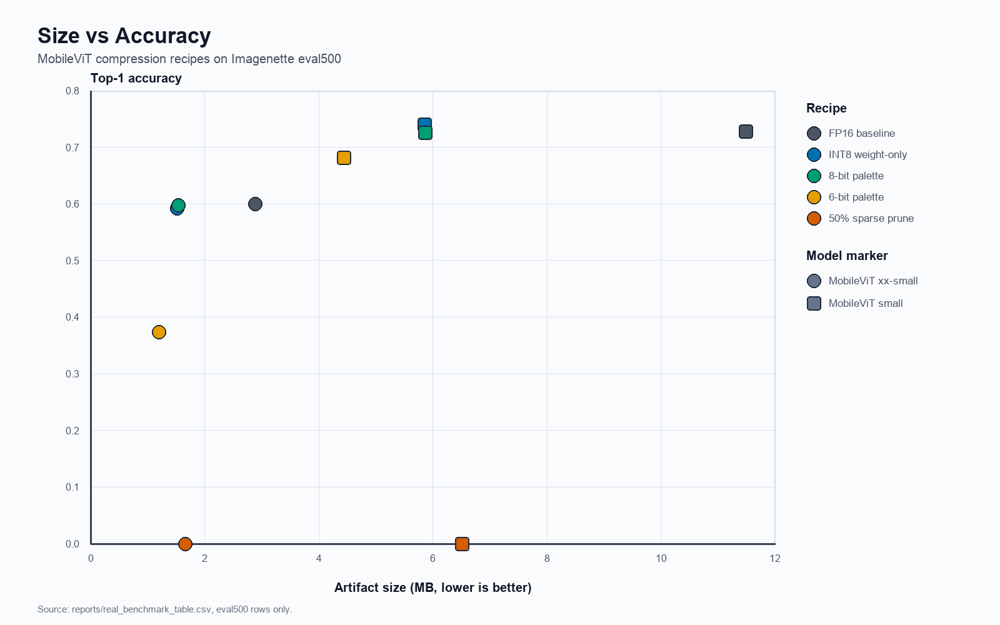
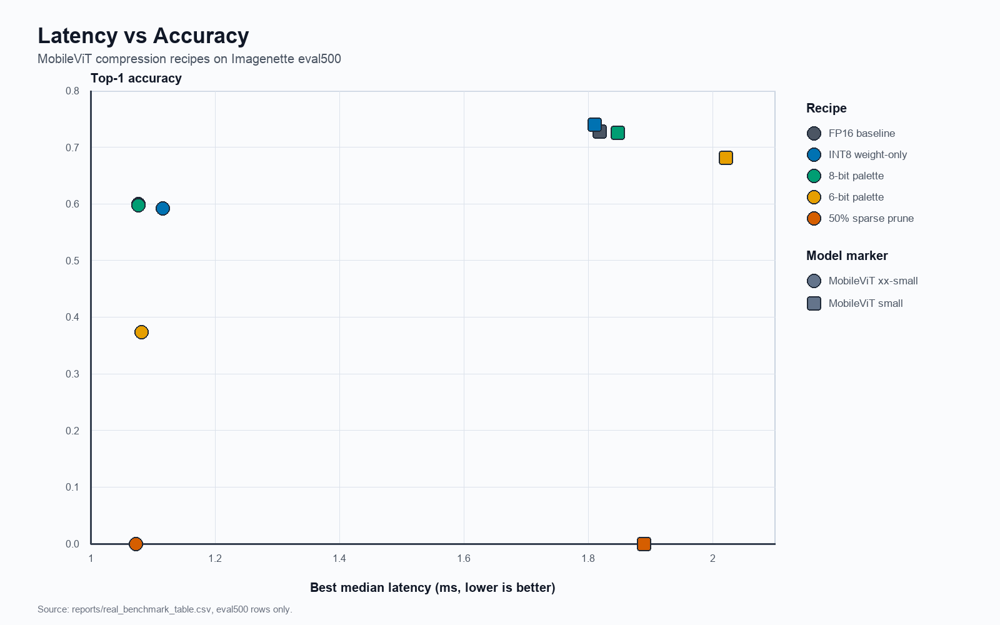

# MobileViT Compression Case Study

This case study uses the real Core ML Imagenette `eval500` benchmark rows as the decision split. The `eval20` rows are useful smoke checks, but `eval500` is the better signal because it has 25x more samples. Metrics and tradeoffs come from `reports/real_benchmark_table.csv`; recipe definitions come from the recipe YAML files and the Core ML compression implementation. [S1] [S2] [S3] [S4] [S5] [S6]

## Direct Answers

**Best size drop:** `palettized-6bit`.

It produced the smallest artifacts on both models: MobileViT xx-small dropped from 2.8852 MB to 1.1991 MB, a 58.4% reduction, and MobileViT small dropped from 11.4904 MB to 4.4418 MB, a 61.3% reduction. The catch is accuracy: xx-small top-1 fell from 0.600 to 0.374, and small top-1 fell from 0.728 to 0.682. That makes it the size winner, not the default shipping recipe. [S1] [S4]

**Preserved accuracy:** `int8-weight-only`.

It was the cleanest accuracy-preserving recipe on the decision split. MobileViT xx-small moved from 0.600 to 0.592 top-1, a 0.008 drop. MobileViT small moved from 0.728 to 0.740 top-1, a 0.012 gain, with top-5 unchanged at 0.954. `palettized-8bit` also preserved accuracy well, but it was slightly weaker overall: both models lost 0.002 top-1, and MobileViT small latency regressed by 0.030 ms. [S1] [S2] [S3]

**Improved latency:** no recipe improved latency reliably across both models.

The best deployable latency result was `int8-weight-only` on MobileViT small: median latency improved from 1.8174 ms to 1.8100 ms, a 0.0074 ms reduction, while accuracy improved. On MobileViT xx-small, `palettized-8bit` was essentially tied with baseline at 1.0770 ms versus 1.0771 ms. The pruned xx-small model was slightly faster, but it collapsed to 0.000 top-1 and is not a valid latency win. [S1]

**Failed:** `pruned-sparse-50` failed as a model-quality recipe.

It did not fail to produce rows, but it failed the benchmark objective: both MobileViT xx-small and MobileViT small reported 0.000 top-1 and 0.000 top-5 on `eval500`. The likely cause is the recipe itself: it applies 50% magnitude pruning through Core ML weight pruning with no fine-tuning or recovery step. That is too destructive for this classifier in the current pipeline. [S1] [S5] [S6]

`palettized-6bit` also fails an accuracy-preservation bar. It is valuable as a size stress test, but the xx-small accuracy loss is too large for an on-device classifier. [S1] [S4]

**Ship on-device:** `apple/mobilevit-small` with `int8-weight-only`.

It gives the best practical balance: 49.0% smaller than FP16, top-1 improves from 0.728 to 0.740, top-5 stays at 0.954, and median latency improves slightly from 1.8174 ms to 1.8100 ms. If the product constraint is absolute file size and a 4.6 point top-1 drop is acceptable, `mobilevit-small` with `palettized-6bit` is the size-first alternative. I would not ship `pruned-sparse-50`, and I would only ship `mobilevit-xx-small` if the app values the smaller baseline model more than the accuracy headroom of `mobilevit-small`. [S1] [S2] [S4] [S5]

## Decision Table

| Model | Recipe | Size MB | Size drop | Top-1 | Top-1 delta | Median latency ms | Latency delta ms | Verdict |
| --- | --- | ---: | ---: | ---: | ---: | ---: | ---: | --- |
| MobileViT xx-small | `int8-weight-only` | 1.5172 | 47.4% | 0.592 | -0.008 | 1.1158 | +0.0387 | Good size, slight accuracy loss, slower |
| MobileViT xx-small | `palettized-8bit` | 1.5387 | 46.7% | 0.598 | -0.002 | 1.0770 | -0.0001 | Best xx-small balance |
| MobileViT xx-small | `palettized-6bit` | 1.1991 | 58.4% | 0.374 | -0.226 | 1.0821 | +0.0050 | Size winner, accuracy loss too high |
| MobileViT xx-small | `pruned-sparse-50` | 1.6568 | 42.6% | 0.000 | -0.600 | 1.0730 | -0.0041 | Failed accuracy |
| MobileViT small | `int8-weight-only` | 5.8558 | 49.0% | 0.740 | +0.012 | 1.8100 | -0.0074 | Ship |
| MobileViT small | `palettized-8bit` | 5.8594 | 49.0% | 0.726 | -0.002 | 1.8471 | +0.0297 | Accurate, but slower |
| MobileViT small | `palettized-6bit` | 4.4418 | 61.3% | 0.682 | -0.046 | 2.0203 | +0.2029 | Size-first only |
| MobileViT small | `pruned-sparse-50` | 6.5077 | 43.4% | 0.000 | -0.728 | 1.8891 | +0.0717 | Failed accuracy |

## Sources

- [S1] [Real benchmark table](real_benchmark_table.csv)
- [S2] [INT8 weight-only recipe](../recipes/int8_weight_only.yaml)
- [S3] [8-bit palettization recipe](../recipes/palettized_8bit.yaml)
- [S4] [6-bit palettization recipe](../recipes/palettized_6bit.yaml)
- [S5] [50% sparse pruning recipe](../recipes/pruned_sparse_50.yaml)
- [S6] [Core ML compression implementation](../src/mlclab/compress/coreml.py)
